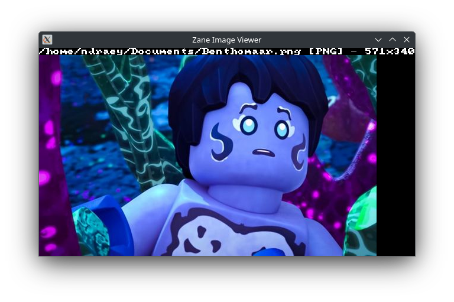

# Zane Image Viewer

The simplest image viewer written in Rust.

It uses [Gi UI](https://github.com/NDRAEY/gi-ui) as GUI backend.

# Supported formats

- [x] PNG
- [x] TGA
- [ ] JPEG
- [ ] QOI
- [ ] WEBP

> Note: Format support limited by [NImage](https://github.com/NDRAEY/nimage), so I do my best to add more formats in future.

# Screenshots



> Screenshot from Ninjago series in PNG format.

# Usage

Run the project using:

```bash
cargo r --release <myfile>
```